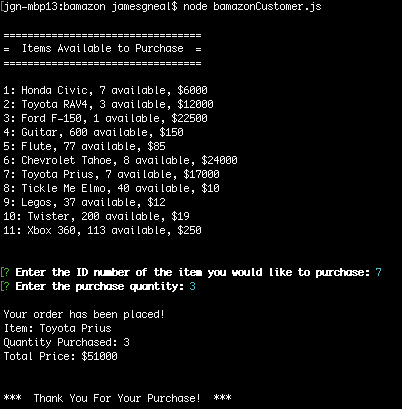

# Bamazon
### Homework Assignment 10 - A CLI program that operates like an online store front

#### Summary
Bamazon is an Amazon-like, Command Line Interface storefront built on a MySQL database. The app takes in orders from customers and depletes stock from the store's inventory.

##### Step 1
When the app is loaded in the terminal, the MySql database is querried for all products, which are displayed along with quantities available, their price, and a unique ID number.

##### Step 2
The user is prompted to input the unqiue ID number of the item they wish to purchase. After that input, the user is prompted for the quantity they would like to purchase.

##### Step 3a
If the quantity requested by the user is _less_ than the quantity available, then the app will calculate and display the total price (quantity requested x item price), as well as update the database with the new quantity available. This completes a successful transaction.

_Figure 1 - Successful Transaction_

##### Step 3b
If the quantity requested by the user is _more_ than the quantity available, then the app will display a message indicating the user cannot purchase that amount, and will return to **step 1**.

_Figure 2 - Unsuccessful Transaction_

#### Skills Used
1. JavaScript
1. Node.js
1. MySql
1. Inquirer NPM
